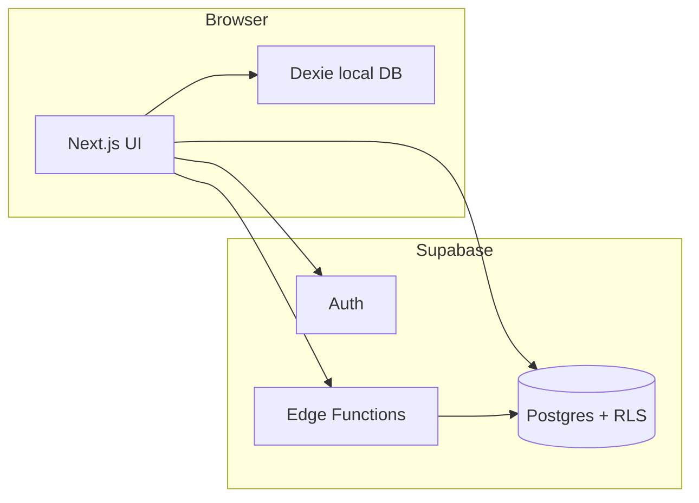

# Mundika project map

This document is the **single orientation page** for engineers, QA, and product: where code lives, what we are building for whom, and how we test it. Keep it updated when modules or scope shift.

---

## Product vision (current)

- **Audience:** Tier-2 / tier-3 traders and small shops — high daily volume of simple decisions, limited patience for “accounting software” chrome.
- **Positioning:** **Khatta khata** (informal ledger, udhaar–jama, stock, bill/chit). **Not in scope right now:** pakka khata, GST returns, formal statutory books, multi-entity consolidation.
- **UX principle:** Few fields, plain language (Hinglish where it helps), no GSTIN or tax jargon in shop profile or primary flows.

---

## Requirements summary (acceptance-oriented)

| Area | Must have | Explicitly out (for now) |
|------|-----------|---------------------------|
| Shop | Dukan naam, mobile, simple pata (city/state optional path) | GSTIN, legal entity fields in UI |
| Ledger / party | Running balance, credit bills, cash | GST line items, e-invoice |
| Marketing | Honest scope: khatta + stock + bill | Claiming full GST compliance |
| Auth | Email + Google, password reset | Enterprise SSO |
| Billing | Stripe (optional), Razorpay placeholder | Tax invoicing as a product |

**Backlog:** GitHub issues [#24](https://github.com/xlibraries/Mundika/issues/24)–[#33](https://github.com/xlibraries/Mundika/issues/33).

---

## Repository layout (where to look)

| Path | Role |
|------|------|
| `app/(app)/` | Authenticated app shell: dashboard, analytics, settings, workspace routes |
| `app/(auth)/` | Login / sign-up UI |
| `app/auth/` | OAuth callback, password reset |
| `components/` | Shared UI: billing doc, workspace blocks, UI primitives |
| `lib/` | Domain logic: shops, billing, pricing, auth helpers, formatters |
| `hooks/` | React hooks (e.g. `use-user-id`) |
| `utils/supabase/` | Browser/server Supabase clients |
| `supabase/migrations/` | Postgres schema, RLS, RPC |
| `supabase/functions/` | Edge Functions (Stripe checkout / webhook when enabled) |
| `.github/AGENT_PLAYBOOK.md` | Dev + Tester + CEO parallel session prompts |
| `e2e/` | Playwright smoke tests |

---

## Runtime architecture (conceptual)

- **Static export:** No Next API routes; paid flows use Supabase Edge Functions where implemented.
- **Operational data:** Much of inventory/billing is still **user-scoped / device-oriented**; `shops` + `shop_members` are the start of **multi-user shop profile** (see issue #26 for future sync).

---

## Data model (high level)

- **Auth:** Supabase `auth.users`.
- **Shops:** `public.shops` (name, address fields, phone, country default `IN` — **no `gstin`** after migration `20260422120000_drop_shops_gstin.sql`).
- **Membership:** `public.shop_members` + RPC `create_shop_with_owner`.
- **Entitlements:** `public.user_entitlements` (Stripe webhook path) when migration `20260422100000_user_entitlements.sql` is applied.
- **Legacy / app tables:** Bills, parties, stock — see `supabase/migrations/*_init.sql` and follow-ups for full DDL.

---

## Testing strategy

### Unit / logic (`vitest`)

- Run: `pnpm test` (or `npm test`).
- Notable suites: `lib/pricing/plans.test.ts`, `lib/auth/safe-next-path.test.ts`, `lib/billing/*test.ts`, `modules/billing/*test.ts`.

### End-to-end smoke (`playwright`)

- Browsers are stored under `node_modules/.cache/ms-playwright` (see `playwright.config.ts`) so installs match test runs in sandboxes and CI.
- First time (or after Playwright upgrade): `pnpm test:e2e:install` (or `npm run test:e2e:install`).
- Run: `pnpm test:e2e` (starts dev server if nothing is on port 3000, or reuses an existing one on `127.0.0.1:3000`).
- `e2e/smoke.spec.ts`: public home, login surface, `/login?next=` preserved (full `/dashboard` → `/login` redirect depends on Supabase env + network; verify manually if needed).

### Razorpay / billing smoke

- With Edge functions deployed and `NEXT_PUBLIC_PAYMENT_PROVIDER=razorpay`, sign in and complete a **test** payment on `/account`; plan should move to Starter. See [`GTM_PLAN.md`](./GTM_PLAN.md) for test vs live and outreach.

### Manual E2E matrix (tie to issues)

Use this as a **repeatable checklist** when closing #24–#33:

1. **Home:** Loads, pricing links include `?plan=`, copy matches khatta-only positioning.
2. **Login:** Google button, email sign-in, sign-up, forgot password email; error states for bad password.
3. **Auth callback:** OAuth completes; `next` / plan hint respected where implemented.
4. **Reset password:** Link from email opens `/auth/reset-password`; new password saves.
5. **Dashboard:** Authenticated user lands; unauthenticated redirect to login.
6. **Shop settings (`/settings/shop`):** Load default shop, save name/phone/pata/city/state; no GST field; country fixed to India in patch.
7. **Account / billing:** With flags off, placeholders; with Stripe enabled, checkout round-trip (staging keys only).
8. **Workspace:** Create party, bill, ledger rows — regression on parties table and bill print view (“Bill” header).

---

## Agent workflow (“continuous” in practice)

We do **not** run three bots in CI. We **do** run a **daily human-driven loop**: same task pasted into three Cursor sessions (Dev, Tester, CEO) per `.github/AGENT_PLAYBOOK.md`. CEO picks 1–2 issues; Dev ships; Tester blocks on missing cases; merge when both sign off. Treat `AGENTS.md` + this file + GitHub issues as the source of truth.

---

## Related docs

- [`AGENTS.md`](./AGENTS.md) — Next.js caveats, Stripe/Razorpay, redirect URLs, links to playbook and issues.
- [`.github/AGENT_PLAYBOOK.md`](./.github/AGENT_PLAYBOOK.md) — Role prompts and loop steps.
